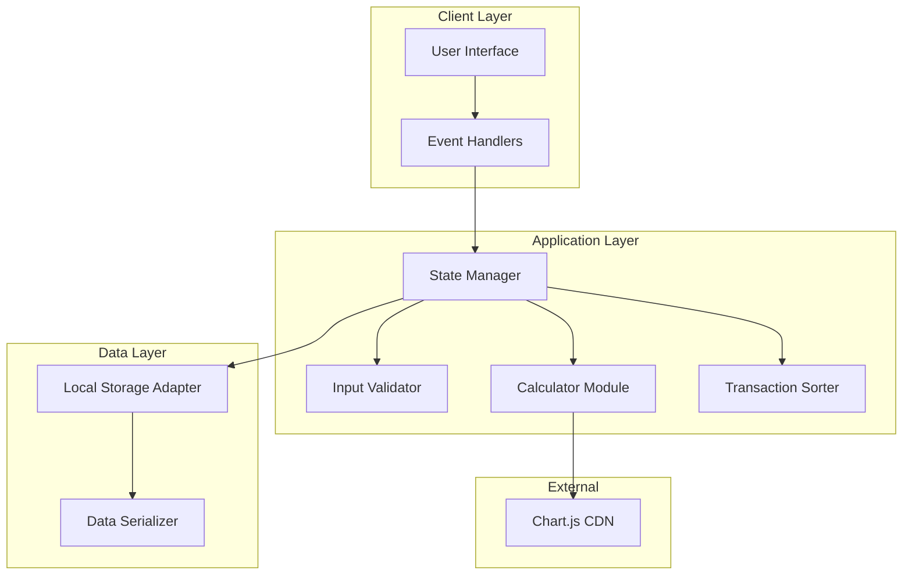
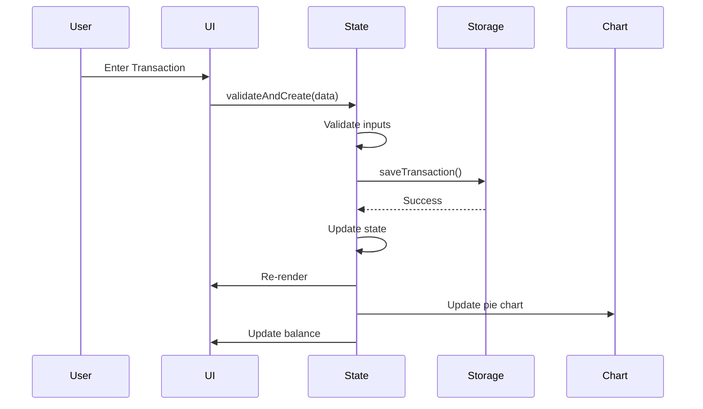

# Design Document: Expense & Budget Visualizer

## Overview

The Expense & Budget Visualizer is a single-page web application for tracking daily spending through transaction entry, balance monitoring, and visual spending analysis. The application operates entirely client-side using browser Local Storage for data persistence, with no backend infrastructure required.

The application follows a mobile-first design philosophy with support for both light and dark themes, providing an intuitive interface for users to manage their expenses across different lighting conditions and devices.

## Architecture

### High-Level Architecture



### Component Communication Flow



## Components and Interfaces

### Core Modules

#### State Manager Module

The central module responsible for managing application state and coordinating between components.

```typescript
interface AppState {
  transactions: Transaction[];
  customCategories: string[];
  spendingLimit: number | null;
  theme: 'light' | 'dark';
  sortOrder: SortOption;
  selectedMonth: string;
}

interface StateManager {
  getState(): AppState;
  addTransaction(transaction: TransactionData): Result<Transaction, ValidationError>;
  deleteTransaction(id: string): void;
  setSpendingLimit(limit: number): void;
  addCustomCategory(name: string): Result<void, CategoryError>;
  setTheme(theme: 'light' | 'dark'): void;
  setSortOrder(order: SortOption): void;
  setSelectedMonth(month: string): void;
  subscribe(listener: StateListener): () => void;
}
```

#### Transaction Module

Handles transaction-related operations including validation, creation, and filtering.

```typescript
interface Transaction {
  id: string;
  name: string;
  amount: number;
  category: string;
  date: string; // ISO date string
}

interface TransactionData {
  name: string;
  amount: number;
  category: string;
}

interface TransactionValidator {
  validate(data: TransactionData): ValidationResult;
  validateName(name: string): ValidationResult;
  validateAmount(amount: number): ValidationResult;
  validateCategory(category: string): ValidationResult;
}

interface TransactionRepository {
  getAll(): Transaction[];
  getById(id: string): Transaction | undefined;
  add(transaction: Transaction): void;
  delete(id: string): void;
  getByMonth(month: string): Transaction[];
  getByCategory(category: string): Transaction[];
}
```

#### Calculator Module

Performs financial calculations for balance, category breakdowns, and monthly summaries.

```typescript
interface Calculator {
  calculateTotal(transactions: Transaction[]): number;
  calculateCategoryBreakdown(transactions: Transaction[]): CategoryBreakdown;
  calculateMonthlyTotal(transactions: Transaction[], month: string): number;
  calculateMonthlyBreakdown(transactions: Transaction[], month: string): CategoryBreakdown;
  isOverLimit(total: number, limit: number | null): boolean;
}

interface CategoryBreakdown {
  [category: string]: {
    amount: number;
    percentage: number;
  };
}
```

#### Sorter Module

Provides transaction sorting functionality.

```typescript
type SortOption = 'amount-desc' | 'amount-asc' | 'category-asc' | 'category-desc';

interface TransactionSorter {
  sort(transactions: Transaction[], order: SortOption): Transaction[];
}
```

#### Storage Module

Abstracts Local Storage operations with serialization handling.

```typescript
interface StorageAdapter {
  getTransactions(): Transaction[];
  saveTransactions(transactions: Transaction[]): void;
  getCustomCategories(): string[];
  saveCustomCategories(categories: string[]): void;
  getSpendingLimit(): number | null;
  saveSpendingLimit(limit: number): void;
  getTheme(): 'light' | 'dark';
  saveTheme(theme: 'light' | 'dark'): void;
  isAvailable(): boolean;
}
```

### UI Components

#### Header Component

```typescript
interface HeaderComponent {
  render(): HTMLElement;
  toggleTheme(): void;
}
```

#### Balance Section Component

```typescript
interface BalanceSection {
  render(balance: number, limit: number | null): HTMLElement;
  updateProgressBar(balance: number, limit: number | null): void;
  showWarning(): void;
}
```

#### Transaction Form Component

```typescript
interface TransactionForm {
  render(): HTMLElement;
  getFormData(): TransactionData;
  clear(): void;
  showValidationError(field: string, message: string): void;
  clearValidationErrors(): void;
}
```

#### Transaction List Component

```typescript
interface TransactionList {
  render(transactions: Transaction[]): HTMLElement;
  setSortOrder(order: SortOption): void;
  showEmptyState(): void;
}
```

#### Pie Chart Component

```typescript
interface PieChartComponent {
  render(breakdown: CategoryBreakdown): HTMLElement;
  update(breakdown: CategoryBreakdown): void;
}
```

#### Monthly Summary Component

```typescript
interface MonthlySummary {
  render(month: string, total: number, breakdown: CategoryBreakdown): HTMLElement;
  setMonth(month: string): void;
}
```

## Data Models

### Primary Data Model

```javascript
// Local Storage Key: 'expenseVisualizer'
{
  transactions: [
    {
      id: "uuid-v4-string",
      name: "Coffee",
      amount: 5.50,
      category: "Food",
      date: "2024-01-15T10:30:00.000Z"
    }
  ],
  customCategories: ["Shopping", "Bills"],
  spendingLimit: 500,
  theme: "light"
}
```

### Entity Definitions

```typescript
// Transaction Entity
interface Transaction {
  id: string;        // UUID v4, auto-generated
  name: string;      // 1-100 characters, non-empty after trim
  amount: number;    // Positive number > 0, max 2 decimal places
  category: string;  // One of: 'Food', 'Transport', 'Fun', or custom category
  date: string;      // ISO 8601 date string
}

// Category Entity
type PredefinedCategory = 'Food' | 'Transport' | 'Fun';
type Category = PredefinedCategory | string; // Custom categories: max 5

// Spending Limit Entity
interface SpendingLimit {
  value: number;     // Positive number > 0
  active: boolean;   // true if set, false if null
}

// Theme Entity
type Theme = 'light' | 'dark';

// Sort Option Entity
type SortOption = 'amount-desc' | 'amount-asc' | 'category-asc' | 'category-desc';
```

### Validation Rules

```typescript
interface ValidationRules {
  name: {
    minLength: 1;
    maxLength: 100;
    pattern: /^[^\s].*[^\s]$|^[^\s]$/; // Non-empty after trim
  };
  amount: {
    min: 0.01;
    max: 999999999.99;
    decimalPlaces: 2;
  };
  category: {
    predefined: ['Food', 'Transport', 'Fun'];
    customMaxLength: 20;
    customMaxCount: 5;
  };
}
```

## Correctness Properties

*A property is a characteristic or behavior that should hold true across all valid executions of a system—essentially, a formal statement about what the system should do. Properties serve as the bridge between human-readable specifications and machine-verifiable correctness guarantees.*

### Property 1: Transaction Creation Preserves Data

*For any* valid transaction data (name, amount, category), the created transaction record shall contain all input fields correctly set with a unique identifier and valid timestamp.

**Validates: Requirements 1.1**

### Property 2: Input Validation Rejects Empty Fields

*For any* transaction submission with at least one empty or whitespace-only field, the validation shall reject the submission and return an appropriate error message.

**Validates: Requirements 1.2**

### Property 3: Positive Amount Validation

*For any* transaction amount value, the validation shall accept only positive numeric values greater than zero.

**Validates: Requirements 1.5**

### Property 4: Transaction Deletion Removes Entry

*For any* transaction list and any transaction within it, deleting that transaction shall result in a list where the transaction no longer exists and all other transactions remain unchanged.

**Validates: Requirements 3.1**

### Property 5: Balance Equals Transaction Sum

*For any* transaction list, the calculated balance shall equal the sum of all transaction amounts.

**Validates: Requirements 4.2**

### Property 6: Category Percentages Sum to 100

*For any* non-empty transaction list, the sum of all category percentages shall equal 100% (within floating-point tolerance).

**Validates: Requirements 5.2**

### Property 7: Predefined Categories Always Present

*For any* transaction list, the category breakdown shall always include Food, Transport, and Fun categories, regardless of whether transactions exist for those categories.

**Validates: Requirements 5.5**

### Property 8: Custom Category Limit Enforcement

*For any* attempt to add a custom category when 5 custom categories already exist, the system shall reject the addition.

**Validates: Requirements 6.2**

### Property 9: Monthly Total Correctness

*For any* transaction list and any month, the monthly total shall equal the sum of all transaction amounts for that month.

**Validates: Requirements 7.1, 7.2**

### Property 10: Month Selection Filters Correctly

*For any* transaction list and any selected month, the displayed transactions and totals shall reflect only transactions from that month.

**Validates: Requirements 7.3**

### Property 11: High-to-Low Sort Order

*For any* transaction list, sorting by amount high-to-low shall produce a list where each transaction's amount is greater than or equal to the next transaction's amount.

**Validates: Requirements 8.1**

### Property 12: Low-to-High Sort Order

*For any* transaction list, sorting by amount low-to-high shall produce a list where each transaction's amount is less than or equal to the next transaction's amount.

**Validates: Requirements 8.2**

### Property 13: Alphabetical Category Sort Order

*For any* transaction list, sorting by category A-Z shall produce a list where categories appear in alphabetical order.

**Validates: Requirements 8.3**

### Property 14: Reverse Alphabetical Category Sort Order

*For any* transaction list, sorting by category Z-A shall produce a list where categories appear in reverse alphabetical order.

**Validates: Requirements 8.4**

### Property 15: Spending Limit Warning

*For any* transaction list and spending limit, the warning indicator shall display if and only if the total spending is greater than or equal to the limit.

**Validates: Requirements 10.2**

## Error Handling

### Error Categories

```typescript
enum ErrorType {
  VALIDATION_ERROR = 'VALIDATION_ERROR',
  STORAGE_ERROR = 'STORAGE_ERROR',
  CATEGORY_LIMIT_ERROR = 'CATEGORY_LIMIT_ERROR',
  NETWORK_ERROR = 'NETWORK_ERROR' // For CDN failures
}
```

### Error Handling Strategy

| Error Type | User Message | Recovery Action |
|------------|--------------|-----------------|
| Empty field validation | "Please fill in all fields" | Highlight empty field, focus input |
| Invalid amount | "Please enter a positive number" | Clear amount field, show helper text |
| Category limit reached | "Maximum 5 custom categories allowed" | Disable category creation button |
| Local Storage unavailable | "Data will not be saved between sessions" | Continue with in-memory storage |
| Chart.js CDN failure | "Chart temporarily unavailable" | Display category breakdown as list |

### Error Display Component

```typescript
interface ErrorDisplay {
  showError(message: string, type: ErrorType): void;
  clearError(): void;
}
```

### Graceful Degradation

1. **Local Storage Unavailable**: Application continues with session-only data, displays warning banner
2. **Chart.js Load Failure**: Falls back to text-based category breakdown display
3. **Invalid Transaction Data**: Prevents submission, shows inline validation messages

## Testing Strategy

### Property-Based Testing Approach

Property-based testing will use a library such as `fast-check` for JavaScript to verify universal properties across generated inputs. Each property test will run a minimum of 100 iterations.

### Unit Testing Strategy

Unit tests will cover:
- Specific examples demonstrating correct behavior
- Edge cases (empty lists, zero amounts, boundary values)
- Error conditions and validation failures
- Component integration points

### Test Configuration

```javascript
// Property test configuration
const propertyTestConfig = {
  numRuns: 100,
  timeout: 10000
};

// Test tags format
// Feature: expense-visualizer, Property N: [property text]
```

### Property Test Coverage

| Property | Test Strategy | Generator |
|----------|---------------|-----------|
| P1: Transaction Creation | Generate random valid transaction data | `fc.record({ name: fc.string(), amount: fc.float(), category: fc.constantFrom(...) })` |
| P2: Input Validation | Generate invalid inputs (empty, whitespace) | `fc.oneof(fc.constant(''), fc.constant('   '), fc.constant(null))` |
| P3: Amount Validation | Generate various numeric values | `fc.oneof(fc.float({ min: -1000, max: 0 }), fc.float({ min: 0.01, max: 10000 }))` |
| P4: Transaction Deletion | Generate random lists, delete random element | `fc.array(transactionArb)` |
| P5: Balance Calculation | Generate random transaction lists | `fc.array(transactionArb)` |
| P6: Category Percentages | Generate transactions with various categories | `fc.array(transactionArb)` |
| P7: Predefined Categories | Generate any transaction list | `fc.array(transactionArb)` |
| P8: Category Limit | Generate 5+ category names | `fc.array(fc.string(), { minLength: 6 })` |
| P9: Monthly Total | Generate transactions with various dates | `fc.array(transactionWithDateArb)` |
| P10: Month Selection | Generate transactions, select random month | `fc.array(transactionWithDateArb)` |
| P11-P14: Sorting | Generate random transaction lists | `fc.array(transactionArb)` |
| P15: Spending Limit Warning | Generate transactions and limits | `fc.tuple(fc.array(transactionArb), fc.float())` |

### Integration Tests

Integration tests will verify:
- Local Storage read/write operations (1-2 examples per operation)
- Chart.js rendering and updates
- Theme persistence across sessions
- Full transaction lifecycle (create, display, delete)

### Browser Compatibility Tests

Manual testing across:
- Chrome (latest 2 versions)
- Firefox (latest 2 versions)
- Edge (latest 2 versions)
- Safari (latest 2 versions)

### Performance Tests

- Initial load time verification (target: < 2 seconds)
- UI responsiveness with 100+ transactions
- Scrolling performance with large transaction lists

### Test File Organization

```
revou/
├── js/
│   └── app.js          # Implementation
└── tests/
    ├── app.test.js     # Unit and property tests
    └── integration.test.js  # Integration tests
```
